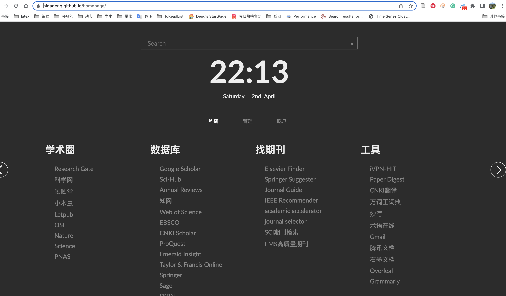
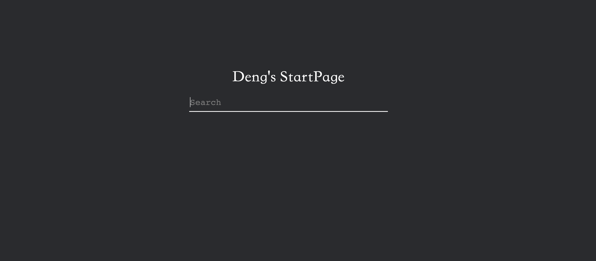
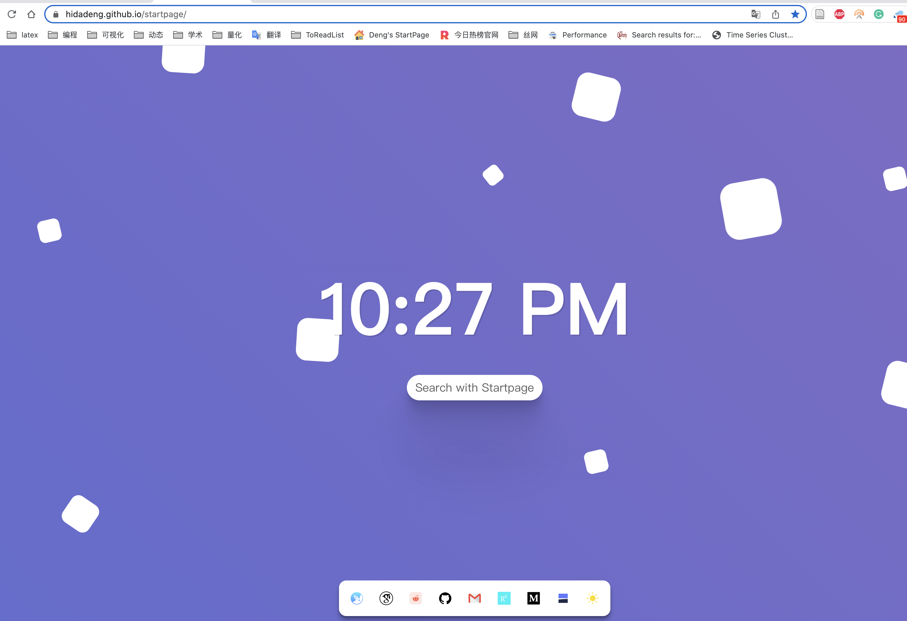
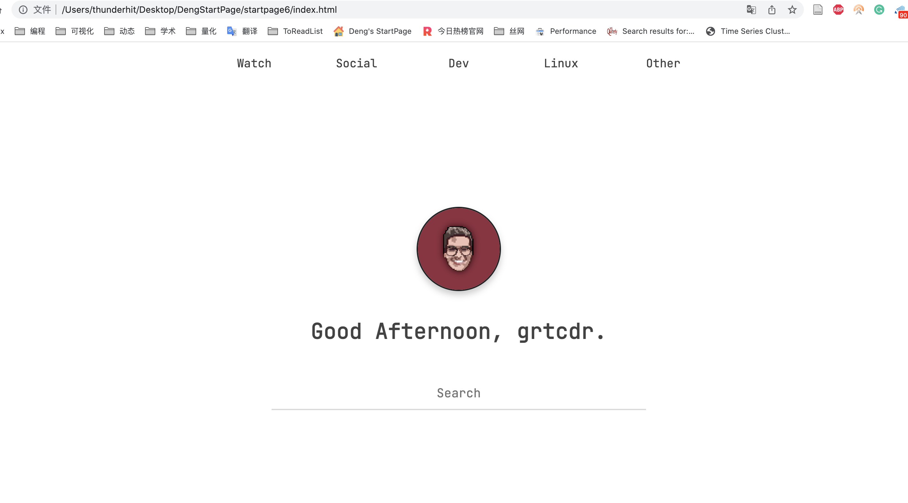
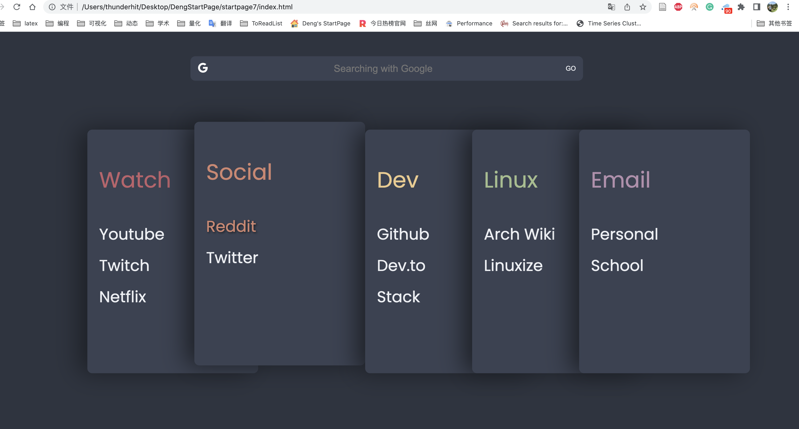
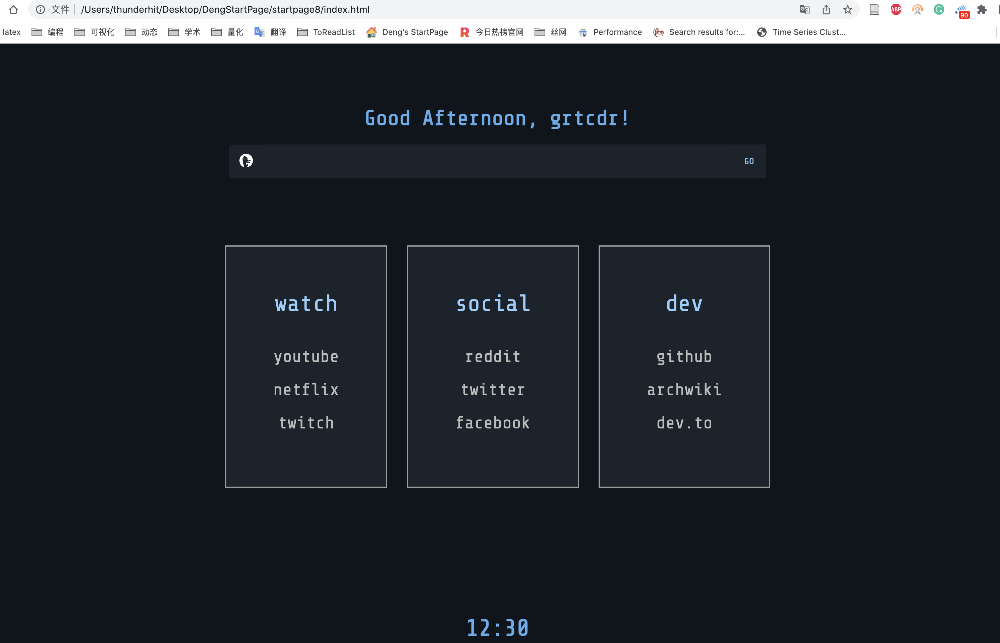
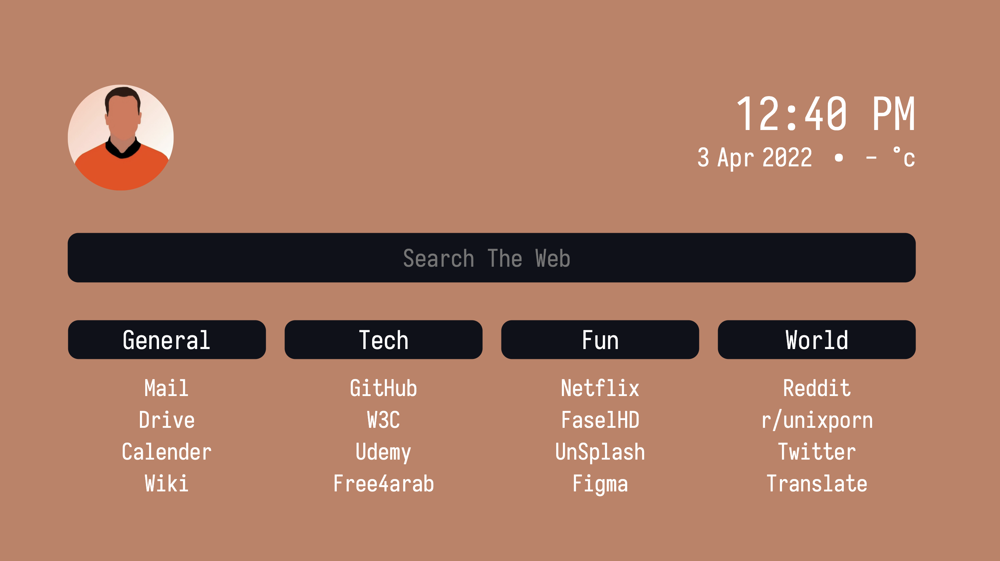
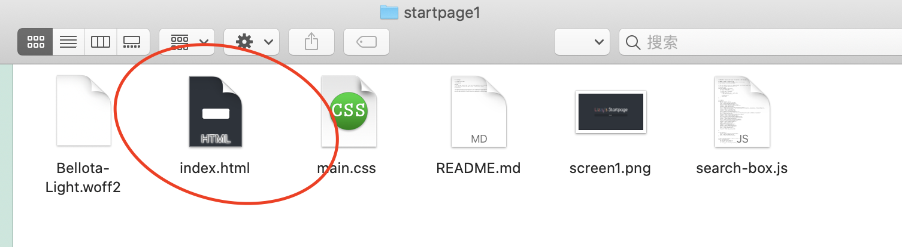

# Deng's StartPage

最近一年多，大邓之前一直使用自己diy的[浏览器启动页](https://hidadeng.github.io/homepage/), 最初是被该启动页的关键词搜索功能所惊艳。但用久了人总会喜新厌旧，但是每次打开浏览器，呈现的网址链接效果太繁杂了。而且大多数都是僵尸链接，平常很少点击的，反而常用的链接都设置成了快捷键。最近整理了网上的一些资源，增加了**快捷关键词搜索方法**

- [old_startpage_demo](https://hidadeng.github.io/homepage/)
- 

  

经过一番搜索，找到以下9个启动页，除了startpage7和startpage8外，大多数启动页都具有**快捷关键词搜索方法**， 大家根据自己喜好进行选择。

## 快捷关键词搜索方法

4个启动页基本拥有相同的**快捷关键词搜索方法**

- 点击时钟，弹出日期框和倒计时信息。
- 搜索框支持`command/`搜索语法. 例如

在搜索框输入``scholar/ python``回车，就能实现在谷歌学术中搜**python**相关信息。类似的功能还有。

  | 搜索框命令 | 目标网站       | 例子                  | 作用                                 |
  | ---------- | -------------- | --------------------- | ------------------------------------ |
  | scholar/   | google scholar | ``scholar/ python``   | 在谷歌学术中搜**python**相关信息     |
  | book/      | 豆瓣读书       | ``book/ python``      | 在豆瓣读书中搜**python**相关书籍信息 |
  | zhihu/     | 知乎           | ``zhihu/ python``     | 在知乎网站搜python相关信息           |
  | youtube/   | youtube        | ``youtube/ python``   | 在youtube搜索python相关视频          |
  | taobao/    | 淘宝           | ``taobao/ python``    | 在淘宝搜python相关商品服务           |
  | jd/        | 京东           | ``jd/ python``        | 在京东搜python相关商品服务           |
  | bilibili/  | B站            | ``bilibili/ python``  | 在B站搜索python相关视频              |
  | github/    | github         | ``github/ python``    | 在github上搜python相关仓库代码等信息 |
  | mail/      | qq邮箱         | ``mail/``             | 默认打开qq邮箱                       |
  | medium/    | Medium         | ``medium/ python``    | 在medium中搜python相关内容           |
  | arxiv/     | arxiv          | ``arxiv/ python``     | 在arXiv中搜python相关论文            |
  | img/       | unsplash图片网 | ``img/ sun``          | 在unsplash中搜sun相关的图片          |
  | scihub/    | scihub         | ``scihub/ 论文的doi`` | 在scihub中根据论文doi寻找论文pdf资源 |

  

## 9个启动页

9个启动页搜索功能略微有些差异，并不是所有的都具备**快捷关键词搜索方法**。

- 第一类，有**快捷关键词搜索方法**，其中startpage1、2、3、5、6、9项目文件夹中使用了相同的搜索引擎js文件**search-box.js**
- 第二类，有**快捷关键词搜索方法**， startpage4使用特有的js文件定义了常用的关键词检索方法，配置文件为**config.js**； 
- 第三类，没**快捷关键词搜索方法**， startpage7、8各自使用的自由搜索引擎。

 

### [startpage1](https://hidadeng.github.io/startpage1/)

- [Demo](https://hidadeng.github.io/startpage1/)

拥有**关键词快捷搜索功能**。简单到项目文件夹中只有html、js、css及字体4个文件。

 

 

### [Startpage2](https://hidadeng.github.io/startpage2/)

- [Demo](https://hidadeng.github.io/startpage2/)

拥有**关键词快捷搜索功能**。如startpage1一般简单，项目文件夹中也只有html、js、css及字体4个文件。

 

### [Startpage3](https://hidadeng.github.io/startpage3/)

- [Demo](https://hidadeng.github.io/startpage3/)

拥有**关键词快捷搜索功能**。相比前两个，这个启动页拥有自动背景切换功能，选取的都是漂亮的油画。

 

### [Startpage4](https://hidadeng.github.io/startpage/)

- [Demo](https://hidadeng.github.io/startpage/)

拥有**关键词快捷搜索功能**。功能最强大，最炫酷的，大邓正在使用的启动页。

 

### [Startpage5](https://hidadeng.github.io/startpage5/)

- [Demo](https://hidadeng.github.io/startpage5/)

拥有**关键词快捷搜索功能**。上方的黑色波浪是动画，实时变化。

 

### [Startpage6](https://hidadeng.github.io/startpage6/)

- [Demo](https://hidadeng.github.io/startpage6/)

拥有**关键词快捷搜索功能**。

 

### [Startpage7](https://hidadeng.github.io/startpage7/)

- [Demo](https://hidadeng.github.io/startpage7/)

注意，startpage7没有**关键词快捷搜索功能**。

 

### [Startpage8](https://hidadeng.github.io/startpage8/)

- [Demo](https://hidadeng.github.io/startpage8/)

注意，startpage8没有**关键词快捷搜索功能**。

 

### [Startpage9](https://hidadeng.github.io/startpage9/)

- [Demo](https://hidadeng.github.io/startpage9/)

拥有**关键词快捷搜索功能**。

 

 

## Code使用方法

下载code压缩文件夹，以**startpage1**文件夹为例， 使用浏览器打开文件夹中的**index.html**文件，浏览器就是如下效果。

 

